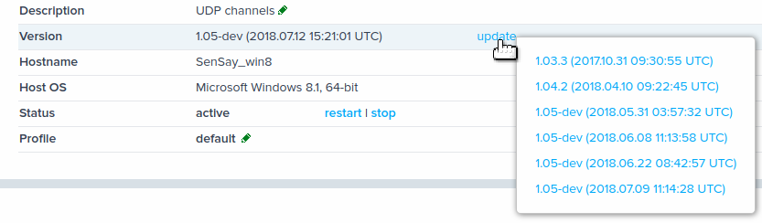
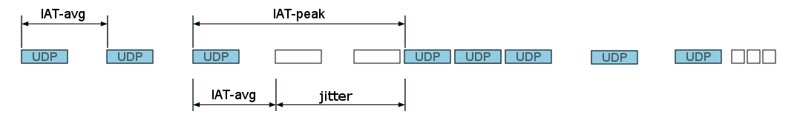
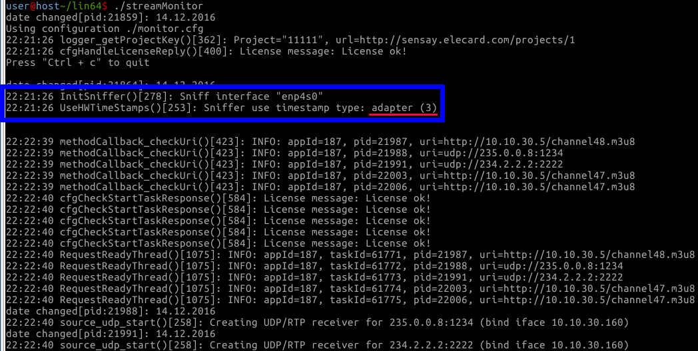
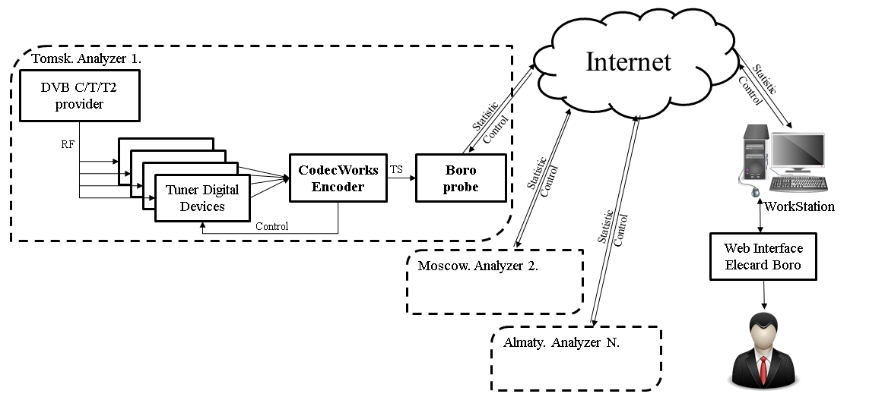

Probe
=====

Differences and Restrictions of Linux and Windows versions
----------------------------------------------------------

.. csv-table:: 
   :header: "Feature", "Linux", "Windows"
   
   "Ethernet parameters* calculation (IAT/MLR/DF)", "Probe is started with root privileges (sudo ./streamMonitor).", "WinPcap (packet capture library) should be installed on the PC before the probe starts (https://www.winpcap.org/install/)."
   "Localhost Ethernet parameters calculation (127.0.0.1)", "No restrictions.", "Localhost IAT calculation is not available. "
   "Ethernet parameters calculation based on timestamps set by a network adapter. (High accuracy of IAT calculation).", "Supported. This mode is used automatically (if supported by the adapter). See more details in the `Ethernet parameters`_ section.", "Not supported."
   
Starting and setting up the probe
---------------------------------

Q: How shall I start working with the monitoring system?
~~~~~~~~~~~~~~~~~~~~~~~~~~~~~~~~~~~~~~~~~~~~~~~~~~~~~~~~
**A:** It is necessary to know several basic points:

1. The system includes a monitoring server (based in cloud) and a software probe, installed by a user in its own network.
2. The responsibility for choosing hardware equipment for a probe is rested upon a user.
3. It is required to download a probe’s archive file using your personal account. Please note, that the archive is attached to the project in your personal account. That means that the probe will show data only in the project from which it has been downloaded.
4. The next step is to start the probe and make sure that it appeared in the system of monitoring (please check a left flip in your personal account at boro.elecard.com).
5. Please note, that it is possible **to start several probes simultaneously**. The number of probes is limited by the number of the analyzed streams which depends on the purchased subscription.
6. If it is required **to start several probes at the same computer**, copy the probe folder (e.g. win64 folder), *because streamMonitor applications started from the same folder can conflict with some files!* 
7. Please, pay attention that the probe does not send the streams to the cloud-based server. The analyzing process is performed locally. The statistical data (bitrate size, registered stream errors), stream structure (PSI table), Closed Caption, SCTE35 data and video thumbnails are sent to the server.  

Q: How can I start the probe as console application?
~~~~~~~~~~~~~~~~~~~~~~~~~~~~~~~~~~~~~~~~~~~~~~~~~~~~

**A:** In order to get the application it is required to go through several steps. If you need detailed information please read `Quick start <https://sensay.elecard.ru/pdf/QuickStart_en_part.pdf>`_ manual. Having downloaded the archive file with application please do the following to start the application:

**Linux**

1. Copy a downloaded archive file to the required directory in Linux. 
2. Install unzip packet if required. See an example of packet installation on CentOs::

		sudo yum install unzip

3. Go to the directory with the archive file and unpack it. See an example of the files extracting to a particular destination folder::

		unzip -d ./boro ESenSay.2016-v1.00-2016.11.07.proj244.zip

4. Open the folder matching your operating system.
5. Edit the "AppDescription" field in the monitor.cfg file (choose a name for the probe which will be indicated in the system) and use a "proxy" field, removing  //  before a proxy server line if required.
6. Run the probe using the console::

		sudo ./streamMonitor

It is required to use **root privileges** to remove restrictions of the operating system and to access packet capture library.

7. In case the probe has been successfully started (the probe is indicated as a green point in a sidebar of your personal account), all further actions (starting, editing and stopping the task) are performed using browser.
8. If the probe has not been started refer to the section `Q: A probe won’t start`_.

**Windows**

1. Extract a received archive file to the required directory.
2. Open the folder matching your OS.
3. Edit the "AppDescription" field in the monitor.cfg file (choose a name for the probe which will be indicated in the system). It is also possible to use a "proxy" field, removing  //  before a proxy server line if necessary.
4. Start the probe as **administrator** (right-click the streamMonitor.exe file -> Run as administrator). Double click on the streamMonitor.exe file to run the probe. A console is supposed to get started.
5. In case the probe has been successfully started, all further actions (starting, editing and stopping the task) are performed using browser.
6. If the probe has not been started refer to the section `Q: A probe won’t start`_.

Q: How to stop the probe correctly if it has been started as the console application?
~~~~~~~~~~~~~~~~~~~~~~~~~~~~~~~~~~~~~~~~~~~~~~~~~~~~~~~~~~~~~~~~~~~~~~~~~~~~~~~~~~~~~~
**A:** To stop the probe correctly, press **once Ctrl+C** on the console and wait (up to 1 min) until the
probe’s normal termination. This method is applicable for Linux and Windows OS.

If you just close the console, the program termination will be incorrect and the program will not be
able to transmit the Stop command to the server. The server will be waiting for the probe’s response
that has been terminated incorrectly up to 1 minute, and then all tasks will change their status to
"stalled".

Q: A probe won’t start
~~~~~~~~~~~~~~~~~~~~~~

**A1:** There is no connection with a server. Stable Internet connection is a necessary requirement for successful start of the probe, as it enables the probe to register at the server. After registration is completed the probe is not sensitive to the connection loss and is using a buffer for the collection and further transfer of the statistical data.
A list of possible errors which might occur while setting up connection with a server:
* Unstable Internet connection (try to restart).
* You are using a proxy server for Internet connection, however it is not specified (or is incorrect) in the monitor.cfg file, or the configuration line is “commented out”.
* Firewall (Brandmauer) restricts the application access to the network. The solution of this problem is described in `Q: Why Boro “does not receive multicast streaming”? PC player is NOT playing the streams!`_ -> **A1: Firewall (Brandmauer)**.

**A2:** You have made certain amendments breaking .json format regulations in the *monitor.cfg* file or added data which is not compatible with the data structure specified at *monitor.cfg*. Moreover, please note, that the **monitor.cfg file must be saved in utf-8**. Generally, in case any problem occurs with a config file parsing errors appear in a console log. This is the first sign proving that there are some problems with the *monitor.cfg*. file.

The solution of the problem:

* Try to find errors in a file (it is difficult for the beginners)
* Download the archive file again using your personal account and place the new unchanged *monitor.cfg* file in a folder which you used to start the probe initially. However, please note, in this case you will lose all the probe's settings and task lists since the last stop of the probe. You will have to name a probe again and, if necessary, set up a proxy server and add tasks to the launched probe using a web-interface.  

.. note:: We strongly recommend using saving/downloading configuration at the server, so that you can avoid problems while editing the monitor.cfg file and you will always have a configuration backup.

See the detailed information about configuration file in the `Configuration file`_ section.

**A3:** Possibly certain libraries were deleted or damaged in the application folder. Download the archive again, replace the *monitor.cfg* file and the *authkey.pub* file with your own files. It is advisable to copy a hidden file .stored.cache, thus providing that there will be no second record with the same probe’s name.

**A4:** Probably you are trying to start a very old version of the probe. Try to download a new version using your personal account, then edit (or replace with the old one) the *monitor.cfg* file and restart the probe.

**A5:** You are using an old version of Linux OS. You need the support of glibc-2.11 or later.

Q: Running and stopping the probe as service (daemon process)
~~~~~~~~~~~~~~~~~~~~~~~~~~~~~~~~~~~~~~~~~~~~~~~~~~~~~~~~~~~~~

**A1: Windows service**

It is not supported.

**A2: Systemd Service (CentOs 7, Ubuntu 16.04)**

Useful link: https://www.dynacont.net/documentation/linux/Useful_SystemD_commands/

1. Create the file /etc/systemd/system/boro-client.service containing the following data::

		[Unit]
		Description=boro probe
		Documentation=https://boro.elecard.com https://boro.elecard.com/pdf/FAQ_en.pdf
		After=network-online.target
		Wants=network-online.target

		[Service]
		#Type=simple
		User=root
		#Group=root
		WorkingDirectory=/opt/boro/dev/lin64
		ExecStart=/opt/boro/dev/lin64/streamMonitor
		PrivateTmp=false
		Restart=always
		RestartSec=120s

		[Install]
		WantedBy=multi-user.target,

Fill in the WorkingDirectory and ExecStart fields correctly to specify the directory of the probe location and path to the executable file correspondingly. 

2. To check the service state, execute the command described below::

		[user@localhost ~]$ systemctl -l status boro-client
		boro-client.service - boro client
		Loaded: loaded (/etc/systemd/system/boro-client.service; disabled; vendor preset: disabled)
		Active: inactive (dead)
		
Highlighted fields indicate that autorun is disabled and the application is not started.

3. To start daemon execute the command::

		systemctl start boro-client
	
	To stop daemon execute the command:::
	
		systemctl stop boro-client
	
.. note:: After Linux reboot, daemon restarts if daemon autorun is enabled.

4. To enable autorun execute the command::

		systemctl enable boro-client
		
	To disable autorun execute the command::
	
		systemctl disable boro-client
		
5. Check the state of running daemon::

		[user@localhost lin64]$ systemctl -l status boro-client
		boro-client.service - boro client
		Loaded: loaded (/etc/systemd/system/boro-client.service; enabled; vendor preset: disabled)
		Active: active (running) since Tue 2017-03-28 16:01:35 +07; 2s ago
	
Highlighted fields indicate that autorun is enabled ( enabled ) and the application is running now (``Active: active (running)``).	
	
**A3: SysV service (out of date Linux distributions)**

Be advised that this init system is saved in modern distributions as legacy. Also, start script functions (/etc/rc.d/init.d/functions) can have different parameters depending on the distribution.

For the script revision, see documents covering service initialization of your distribution.

This section describes how to create init script for the **Linux CentOs 6.8** distribution. Documents for the script preparation are located in: ``/usr/share/doc/initscripts-*/sysvinitfiles``.

1. Go to the directory ``/etc/rc.d/init.d``
2. Create the ``boro-client`` file (root privileges are required) containing the script described below.

While creating the script in Windows (CRLF), pay attention to Linux line break style (LF only) which is explicitly required by the bash interpreter. ::

		#!/bin/sh
		# chkconfig: - 98 02
		# description: OTT and multicast probe.
		# processname: BoroProbe

		# Source function library.
		if [ -f /etc/init.d/functions ] ; then
			. /etc/init.d/functions
		elif [ -f /etc/rc.d/init.d/functions ] ; then
			. /etc/rc.d/init.d/functions
		else
			exit 0
		fi
		KIND="Boro-probe"
		PROCPATH="/opt/boro/lin64"

		start() {
		  echo -n $"Starting $KIND services: "
		  daemon --check=streamMonitor $PROCPATH/streamMonitor >/dev/null 2>&1 &
		  #daemon --check=streamMonitor $PROCPATH/streamMonitor >$PROCPATH/proclog.log 2>&1 &
		  echo
		}

		stop() {
			echo -n $"Shutting down $KIND services: "
			killproc streamMonitor
			echo
		}

		restart() {
			echo -n $"Restarting $KIND services: "
				stop
				start
		}

		case "$1" in
			start)
				start
				;;
			stop)
				stop
				;;
			restart)
				restart
				;;
			status)
				status streamMonitor
				;;
			*)
				echo $"Usage: $0 {start|stop|restart|status}"
				exit 1
		esac
		exit $?

3. Set the ``PROCPATH`` variable in the script correctly. It is the path to the probe’s catalogue.
4. Process log can be saved to a file or discarded. Use one of the two options below:
	Log is discarded::
	
		daemon --check=streamMonitor $PROCPATH/streamMonitor >/dev/null 2>&1 &
		#daemon --check=streamMonitor $PROCPATH/streamMonitor >$PROCPATH/proclog.log 2>&1
	
	Log is saved in the proclog.log file in the probe’s folder::
		
		#daemon --check=streamMonitor $PROCPATH/streamMonitor >/dev/null 2>&1 &
		daemon --check=streamMonitor $PROCPATH/streamMonitor >$PROCPATH/proclog.log 2>&1
5. Save changes in the ``boro-client`` file.	
6. Change the script access permissions (root privileges are required)::
	
		chmod 755 /etc/rc.d/init.d/boro-client
		
7. Add the script to the init system: ``chkconfig --add boro-client``
8. Add the service to startup: ``chkconfig boro-client on``
9. The probe automatically runs as service after OS rebooting.

To check the service status, start and stop it manually, execute the following commands from the directory: ``/etc/rc.d/init.d`` ::

		./boro-client status
		./boro-client start
		./boro-client 

The ``chkconfig --list`` command displays a list of system services and whether they are started (on) or stopped (off) in runlevels 0-6.
To switch off the service startup, execute the command: ``chkconfig boro-client off``.

Probe update
------------

There are two ways for a probe update: 

* Web-update via the command from the personal account (remote update);  
* Command in the console (local update). 

.. important:: All settings and tasks are saved during update. However, Elecard recommends to save all configurations at the server or to create a copy of the configuration file (monitor.cfg) before starting update.

Q: The probe remote update from web
~~~~~~~~~~~~~~~~~~~~~~~~~~~~~~~~~~~

**A:** Run the current probe(-s) and go to the probe’s page clicking on the relevant probe name in the side flip. You can see in the picture that there is an update (blue link Update to: and update version). Click the link.

The probe should update within 1 minute, the web-page should update after and a new version of the probe should appear in the Version field. If the web-page has not updated automatically, press F5.

While updating the problems may occur if a very old version of the probe has been used before. In this case the probe restart on the remote PC may be required. Besides, the earlier versions of the probes have not supported the web-update, use update from the command line described below.

Q: The probe update from the command line
~~~~~~~~~~~~~~~~~~~~~~~~~~~~~~~~~~~~~~~~~

**A:** To update from the command line follow the steps mentioned below:

1. If the probe is running, stop it by pressing Ctrl+C in the command line. If the probe is running as daemon/service, refer to the question `Q: Running and stopping the probe as service (daemon process)`_.
2. Go to the directory in the console where the probe is located and run the probe with the -u parameter:

	Linux:        ``./streamMonitor -u``
	
	Windows:   ``streamMonitor.exe -u``
	
If there is an update on the server, the probe will update required components and show the updated version.
If update is not available, a message No updates! will be shown in the console.

3. To check the current probe version, use the parameter “-v “::

		user@localhost lin64]$ ./streamMonitor -v
		date changed[pid:20373]: 29.03.2017
		Version: 1.01
		Build info: 2017.03.20 08:36:02 UTC
		Platform: lin64

Configuration file
------------------

.. important:: Due to intensive development of the project, this section may contain inaccuracies or divergences. Be advised, that developers of Elecard company try to ensure backward compatibility of the probe configuration file with the latest software releases as much as possible. If the probe is managed via Browser, all configurations and adjustments are applied in the monitor.cfg file. Moreover, the file content will be updated automatically in compliance with the default format of the currently used probe. So, if you are going to set tasks to the probe by editing the monitor.cfg file, always save a backup copy of the file.  

Q: What is a configuration file?
~~~~~~~~~~~~~~~~~~~~~~~~~~~~~~~~

**A:** This is the monitor.cfg file received from the archive file via your personal account (see `Quick start <https://sensay.elecard.ru/pdf/QuickStart_en_part.pdf>`_ manual), and located in the directory together with the streamMonitor executable file. Configuration file is intended for the probe settings storage including a tasklist. While controlling the probe, setting tasks for analysis and other actions performed on the server, the configuration file is modified by the probe application. When starting, restarting or rebooting the probe it uses the monitor.cfg file to retrieve the recently saved configurations.

One of the methods of setting tasks to the probe is to modify the monitor.cfg file.

One of the methods of transferring settings and backup is to save and copy the monitor.cfg file.

Q: Configuration file editing
~~~~~~~~~~~~~~~~~~~~~~~~~~~~~

**A1:** Before start editing a configuration file look through basic information described below:

1. Minimal set of parameters required for successful start of the probe application is included in the monitor.cfg file contained in the downloaded archive file. 
2. Be very careful with the .json format, because it may cause errors. 
3. The monitor.cfg file must be saved as utf-8.
4. Try to set a couple of tasks from web to the probe and see, how complex data objects will be added to an empty configuration file.
5. While debugging, save a copy of the monitor.cfg file before start controlling from bowser.
6. A complex configuration file created automatically should not concern you. It is recommended to add a simple task list (URI + name) to monitor.cfg. Then you will be able to set and change task group settings via browser.
7. Configurations can be modified in browser at any time. The main purpose for you is to create a list of URI and task names suitable for starting the probe.  
8. See examples below, they are easier than the ones created automatically.

Configuration is saved in the format similar to json. In addition:

* С-type comments arу supported:
	* Text starting with ``/*`` and ending with ``*/`` forms a comment block.
	* Text starting with // and till the end of the line is a comment.
* An additional comma after the last value in the data object is supported.

**Fields and parameters**

The fields required for minimal configuration file suitable for assigning a tasklist to the probe are described below. It is supposed, that all required configurations will be set via web after starting the probe.

**"AppDescription"** – text description/name of the probe (Cyrillic characters are supported). The probe is described in this field, for example, its location. This information will appear as names in the “Probes” left slide bar of the browser (working with server).  

.. note:: after the first start of the probe a record will be created at the server, which can not be updated by editing the AppDescription field in the configuration file. Update the name in browser or use the following parameter to create a new record in the “Probes” slide bar if required: ``streamMonitor.exe --create-new-record``

**"uri" & "addr"** - Path to the analyzed streams. There are several options to set URI (URI groups). See the examples followed in the end of this section.

The following prefixes are supported: ``file://``, ``udp://``, ``rtp://``, ``http://``. In addition, HLS format is supported as well (URL should end with .m3u or .m3u8).

You can give names to each stream entering it in the **"name"** field (Cyrillic characters are supported).

Also, it’s possible to bind URI (URI groups) with the particular network interface by specifying the **"iface"** parameter.

If URI group is set in configuration, only one stream of the list will be analyzed when signup expires.

**"proxy"** – specifies proxy server for communication of Boro-probe with the server.

**"defaultBindAddress"** – defines NIC IP as a default IP address. This parameter allows receiving streams from different networks without editing a routing table.

**"iface"** – connects the specified URI (URI group) with network interface.

**"name"** – name of stream (for example, channel name).

**Examples**

See example of setting the “task in one line” style, URI and names fields. The defaultBindAddress field will influence all tasks in a tasklist. This option is very useful as it helps to form a configuration file in spreadsheet programs:: 

	{
		"config": 	{
				"AppDescription": 	"Elecard probe",
				"server": "https://boro.elecard.ru"
				"defaultBindAddress": "192.168.0.129",
				"uri": [
		{"addr": "udp://239.0.0.22:1234","name": "Channel_1","iface":"10.10.30.197",},
		{"addr": "udp://239.0.0.41:1234","name": "Channel_2","iface":"10.10.30.197",},
						{"addr": "udp://239.0.0.71:1234","name": "Channel_3",},
						{"addr": "udp://239.0.0.73:1234","name": "Channel_4",},
						{"addr": "udp://239.0.0.181:1234","name": "Channel_5",},
				]
		}
	}

Similar example with wrapped fields::

	{"config": {
	"AppDescription": "Test Probe, Russia, Tomsk, 3 Razvitiya ave",
	"defaultBindAddress":"192.168.0.129",
	"uri": [
		{
		  "addr":"udp://239.0.0.22:1234",
		  "name":"Channel_1",
		  "iface":"10.10.30.197",
		},
		{
		  "addr":"udp://239.0.0.41:1234",
		  "name":"Channel_2",
		  "iface":"10.10.30.197",
		},
		{
		  "addr":"udp://239.0.0.73:1234",
		  "name":"Channel_4",
		},
	],
	//"proxy": "http://10.192.173.239:3128",
	}}

Other options of setting tasks::

	{"config": {
		"AppDescription": "Test Probe, Russia, Tomsk, 3 Razvitiya ave",
		"defaultBindAddress":"192.168.0.129",
	 
	//sample #1  Single URI
	"uri":"file:///opt/serga/myWorkLog/2015/02/02.19/scte35/mpegwithscte35.ts",
	  
	//sample #2  groupe of URI
		"uri": [
	"http://tv2.seversk.ru:8005/stream/1kanal",
	"udp://235.0.0.2:1234",
	"udp://235.0.0.1:1234"
		],
	  
	//sample #3 mix type
		"uri": [
	{
	"addr":"udp://234.4.4.4:1234",
	"name":"1st channel",
	"iface":"192.168.4.8",
	},
	{
		"addr":"http://samples.ffmpeg.org/ffmpeg-bugs/trac/ticket3356/mpegwithscte35.ts",
	"name":"2nd channel",
	"iface":"172.16.1.59",
	},
	"http://95.170.157.5:8880/eda.m3u8",
	"http://95.170.157.5:80/channel84.m3u8",
		],
	 
	//sample #4 mix type
		"uri": [
	{
	"addr":[
	"udp://235.0.0.1:1234",
	"udp://235.0.0.3:1234",
	"udp://234.5.5.57:10200"
	],
	"iface":"10.10.30.231",
	},
	{
	"addr":"udp://235.0.0.4:1234",
	"name":"3rd channel",
	"iface":"10.10.30.231",
	},
	"http://95.170.157.5:8880/eda.m3u8",
	"http://95.170.157.5:80/channel84.m3u8",
		],
	}}

Multicast monitoring
--------------------

Q: How can I define if multicast stream is being received at my PC?
~~~~~~~~~~~~~~~~~~~~~~~~~~~~~~~~~~~~~~~~~~~~~~~~~~~~~~~~~~~~~~~~~~~

**A0:** Try to start the probe and configure a task to analyze a desired multicast stream.

**A1:** One of the easiest ways is to play the stream using a network player (for example, `vlc player <https://www.videolan.org/>`_).

If the stream is successfully played that means you are able to receive a stream at your PC and it can also be received by the Boro probe.

If the stream is not played it does not necessarily mean that you are not receiving the multicast streaming. Probably, your routing table has wrong settings. In order to avoid routing rules, Boro uses a direct assignment of network interface. Please, fill in the field “Network interface IP” correctly and check if the Boro probe is receiving data. In case “Network interface IP” field is empty, the probe will receive data according to the routing table.

**A2:** Another way is to dump the stream using a socat utility. Please refer to the section `Q: How can I dump a multicast stream for further analysis?`_ to find out more details about a socat utility and to see an example of a command. If dump is successfully created, it means that you are receiving the stream. In case a dump file is created but nothing is recorded in this file (file size is equal to 0), it means that you are not receiving the specified stream in your user space for some reasons. 

.. note:: Note, that a direct assignment of a network interface is used in this example, that’s why a routing table does not influence the possibility of receiving the stream.

**A3:** If the Boro probe fails in receiving multicast streams, please read carefully two situations described below.

Q: Why Boro “does not receive multicast streaming”? PC player is playing the streams!
~~~~~~~~~~~~~~~~~~~~~~~~~~~~~~~~~~~~~~~~~~~~~~~~~~~~~~~~~~~~~~~~~~~~~~~~~~~~~~~~~~~~~~~

**A0:** Your PC is receiving the specified multicast stream and the problem relates to the probe’s settings.

**A1:** The most popular problem is incorrect task assignment to the probe. Which means that the main problem is the incorrect multicast group.

The example of the correct URI: ``udp://235.0.0.5:1234``

The examples of the incorrect address: ``udp://235.0.0:5:1234`` or ``udp://235.0.0.0.5:1234``

.. note:: Note, that it is quite difficult to find such a mistake at the first sight, so be careful while entering the URI address.

**A2:** The second most typical mistake is incorrect choice of the network interface IP. Please check if the IP address is specified correctly. As a next step make sure that your interface is still present in the system and the desired NIC is used for receiving multicast. Network cards’ IP, virtual interfaces’ IP and 127.0.0.1 address (aka localhost) can be also used as the address. If the address is not specified, the streams will be received according to the routing table.

This mistake often occurs while copying the probes’ configuration files from one PC to another. We recommend using a helpful tool designed for saving and downloading the probe’s settings which is available at the probe’s configuration page. Use the buttons “Save configuration” and “Apply configuration”.

Q: Why Boro “does not receive multicast streaming”? PC player is NOT playing the streams!
~~~~~~~~~~~~~~~~~~~~~~~~~~~~~~~~~~~~~~~~~~~~~~~~~~~~~~~~~~~~~~~~~~~~~~~~~~~~~~~~~~~~~~~~~~~~~~~

**A0:** It is necessary to find out if your PC is able to receive multicast streaming or not. Follow two steps:

1.	Establish multicast group membership
2.	Explore traffic on a required network interface

**Linux**

In order to install utilities and packages please use a package manager matching your operating system ( root privileges are required).

You may add multicast group membership using this command (in one line)::

		socat -u UDP4-RECV:7777,ip-add-membership=<MULTICAST_IP>:<NIC_IP>,reuseaddr CREATE:/dev/null
	
The following methods, described below, can be used in order to check traffic. The methods relate to a packet capture (bypassing all possible system filters). Moreover you may use a `Promiscuous mode <https://en.wikipedia.org/wiki/Promiscuous_mode>`_ – a mode which enables a NIC to pass all traffic it receives to the central processing unit (CPU) rather than passing only the frames that the controller is intended to receive.

1. The Iftop utility in a promiscuous mode. Manual. An example of a command::

		iftop -p -i <INTERFACE_NAME> -F <MULTICAST_IP>/32

A line with the specified multicast group should appear in the utility table.

2. The tcpdump utility. Manual. An example of a command (in one line)::
	
		tcpdump -i <INTERFACE_NAME> dst <MULTICAST_IP> and udp dst port <MULTICAST_PORT>

A list of received packets should be displayed (within 10-20 sec) at the specified MULTICAST IP.  

**Windows**

You may establish multicast group membership by playing the stream in `vlc player <https://www.videolan.org/>`_ or starting to dump a stream using a socat utility (please refer to `Q: How can I dump a multicast stream for further analysis?`_ for a detailed description).

It is recommended to use the following utilities in order to check traffic:

1. The **WinDump** utility. `Download <http://www.winpcap.org/windump/install/default.htm>`_. `Manual <http://www.winpcap.org/windump/docs/manual.htm>`_. It requires `installation <http://www.winpcap.org/install/default.htm>`_ of the **WinPcap** driver.

The command is identical to the one described for Linux OS::

	WinDump.exe -i <INTERFACE_INDEX> dst <MULTICAST_IP> and udp dst port <MULTICAST_PORT>
	
The only difference is specification of the adapter’s name. For Windows it is necessary to use indexes which can be got using a command::

	WinDump.exe -D

2. **WireShark program**. You can download the program and read Manual at the official website www.wireshark.org.

In case you do not receive a traffic, the problems may be possibly related to the source of multicast streaming, network equipment or some problems with IGMP joining.
If you are able to receive traffic at your PC, most probably it is being filtered and is not reaching user space. Below you may find a list of possible reasons why traffic might be filtered:

**A1:** If the traffic is detected by the sniffer, check the Firewall (Brandmauer) configuration.

**Linux**

In order to make sure the problem is caused by firewall you may temporarily switch it off:

* ``ufw disable`` - for Ubuntu,
* ``systemctl stop firewalld`` - for CentOS 7.

Instead of switching off a firewall, one of the following solutions can be applied in CentOS 7:

1.	Add permissions for all incoming igmp and multicast udp packets for all interfaces::

		firewall-cmd --permanent --direct --add-rule ipv4 filter INPUT 0 -m udp -p udp -m pkttype --pkt-type multicast -j ACCEPT
		firewall-cmd --permanent --direct --add-rule ipv4 filter INPUT 0 -p igmp -j ACCEPT
		firewall-cmd --reload

2. Move interface to a trusted zone (using `FirewallD on CentOS <https://www.digitalocean.com/community/tutorials/how-to-set-up-a-firewall-using-firewalld-on-centos-7>`_ terms)::

		firewall-cmd --zone=trusted --change-interface=<INTERFACE_NAME>

**Windows**

Sometimes, Windows firewall may forbid the access to multicast streaming. In that case you should allow streamMonitor.exe using private and public networks (set “private” and “public” checkboxes in Windows firewall). 

.. note:: Note, that configuration methods applicable to firewall settings vary in different versions of Windows OS, use a “Search” option in your browser.

**A2:** Reverse Path Filtering (Linux only) is a mechanism checking whether a receiving packet source address is routable (`link <http://tldp.org/HOWTO/Adv-Routing-HOWTO/lartc.kernel.rpf.html>`_). It might be useful to switch off the following filter::

	echo 0 >/proc/sys/net/ipv4/conf/<IFACE>/rp_filter
	echo 0 >/proc/sys/net/ipv4/conf/all/rp_filter

<IFACE> is an interface name for which a filter switch-off is performed.

If Reverse Path Filtering causes an issue, the filter can be switched off permanently by editing sysctl.conf  (<IFACE> should be replaced with the interface name) as follows::

	cat >>/etc/sysctl.conf <<EOF
	# disable RP filter:
	net.ipv4.conf.<IFACE>.rp_filter = 0
	net.ipv4.conf.all.rp_filter = 0
	EOF

**A3:** Using port less than 1024 in Linux requires root privileges. Such ports are regarded as “system” in many OS. Correspondingly, probe is not able to receive data (will fail to bind to a port). The similar log will be shown in a console::

	09:08:28 source_udp_start()[258]: Creating UDP/RTP receiver for 224.1.5.172:1001 (bind iface 172.16.67.10)
	09:08:28 small_rtp_init_receiver()[254]: ERROR: bind failed, err 0xD
	09:08:28 small_rtp_init2()[414]: ERROR: small_rtp_init_receiver: failed
	09:08:28 source_udp_start()[279]: ERROR: small_rtp_init failed with code -1

There is only one simple solution of this problem – you should start the probe as root. ::

	sudo ./streamMonitor
	
Q: How can I dump a multicast stream for further analysis?
~~~~~~~~~~~~~~~~~~~~~~~~~~~~~~~~~~~~~~~~~~~~~~~~~~~~~~~~~~

**A:** The easiest way to dump (save to .ts file) the multicast stream is to use a socat utility.

**Windows**

Please `download <http://blog.gentilkiwi.com/programmes/socat>`_ a socat build for Windows. `Manual <http://www.dest-unreach.org/socat/doc/socat.html>`_. At the moment of writing this paper socat version 2.0.0 (beta 5) has been tested on Windows 8.1. 

The example of the command (in one line)::

	socat -u UDP4-RECV:<PORT>,ip-add-membership=<MULTICAST_IP>:<NIC_IP>,reuseaddr CREATE:dump_name.ts
	
The stream will be saved to a file with a specified data and name until a utility is stopped.

**Linux**

Socat utility. `Manual <http://www.dest-unreach.org/socat/doc/socat.html>`_. The example of the command (in one line)::

	socat -u UDP4-RECV:<PORT>,ip-add-membership=<MULTICAST_IP>:<NIC_IP>,reuseaddr CREATE:dump_name-`date +'%F-%H.%M'`.ts
	
The stream will be saved to a file with a specified data and name until a utility is stopped.

.. note:: Note, that a build for Linux has an issue: this command will dump all the multicasts having the mentioned port. Multicast IP-address is mentioned here only for the reason of multicast joining (sending IGMP request).

IGMP protocol versions
~~~~~~~~~~~~~~~~~~~~~~

**A:** You may set IGMP protocol version in Linux using a following command::

	echo 2 > /proc/sys/net/ipv4/conf/eno2/force_igmp_version
	
Registered Parameters
---------------------

Graphs
~~~~~~

**Download rate** – a graph representing a download rate over the HTTP/HTTPS protocols. Download rate for HLS-streams is defined as the ratio of a segment size to its download time.

**Multicast Rate** – a graph showing total bitrate of incoming UDP/RTP stream.

**Bitrate** – a graph showing payload data bitrate (audio and video streams), EIT (Event Information Table) and padding (null packet, PID 0x1fff) data.

**EPSNR** – a graph showing a statistical estimate of the digital video content distortion during encoding. It is expressed in dB and defined as a ratio of peak mean square video signal to mean square deviation of the output signal from the original one. EPSNR (Estimated Peak Signal to Noise Rate) value estimation is based on encoded video stream data, i.e no original video content (not encoded) is required. EPSNR is used to estimate encoders’ performance quality. To estimate it the following values may be used: 25-30 dB - low quality, 45-50 dB - high quality.

**Maximum Inter-packet Arrival Time (IAT) : Media Lose Rate (MLR)** - a summary graph representing IAT and MLR parameters. This graph is available for IPTV monitoring only. This parameter allows detecting network signal losses and jitter in details. Two horizontal lines displayed on the graph indicate warning and error thresholds of the IAT parameter. Four-colored scheme is applied: green belongs to the IAT values that are lower than the stated warning threshold; yellow belongs to the values that are higher than the stated warning threshold but lower than the error threshold; orange - IAT values exceed the error threshold. No signal value is highlighted red.

To set thresholds for both parameters, go to the Project Settings -> Task profiles -> Thresholds. 

**MDI Media Delivery Index [Delay factor (DF) : Media Loss Rate (MLR)]** - a summary graph representing Delay factor (DF) and MLR parameters . This graph allows estimating signal delivery quality based on the two parameters: packet loss and indirect analysis of a signal jitter (based on DF values). 

**Continuity Counter Errors** - a graph showing CC errors (TR 101 290 error 1.4 Continuity Counter) distribution.

**Clock Continuity Errors** - a graph showing ClockContinuity errors distribution.

Thumbnails
~~~~~~~~~~

**Thumbnails** – capture of video thumbnails within the specified time interval. In addition, thumbnails capture interval should be set up for the detected advertisement period marked with the SCTE-35. Enable the “Thumbnails capture” checkbox in the task configuration form to activate thumbnails capturing.

Parameters, Events and Errors
~~~~~~~~~~~~~~~~~~~~~~~~~~~~~

**Mapping** – an array specifying the number of TS packets included in one IP packet, which have been detected within the last 3 seconds according to frequency of their occurrence. Usually, one IP packet contains 7 transport packets.

TOS/DSCP – `Type-of-service <https://en.wikipedia.org/wiki/Type_of_service>`_, field in IP header. 

TTL – `Time to live <https://en.wikipedia.org/wiki/Time_to_live>`_ 

**Src address/Src MAC** – IP and MAC addresses of multicast source. 

**Dst MAC** – Destination MAC. IPv4 multicast packets are delivered using the Ethernet MAC address range ``01:00:5e:00:00:00–01:00:5e:7f:ff:ff``. See more details following the `link <https://en.wikipedia.org/wiki/IP_multicast>`_.

**Maximum Inter-packet Arrival Time (IAT)** – a graph representing maximum inter-packet arrival time. Packet jitter can be detected by checking inter-packet arrival time. Maximum IAT is defined as a summary of average IAT and jitter. Maximum IAT value is measured every second. Calculated in milliseconds. The parameter is described in more detail in the Section `Q: What is Maximum Inter-packet Arrival Time IAT?`_.

**MinIAT** – the minimum inter-packet arrival time registered per a second. Calculated in milliseconds. 

**AvgIAT** – the average inter-packet arrival time recalculated each second. Calculated in milliseconds. The AvgIAT value approximates the expected IAT value for Constant bitrate stream with the constant mapping that equals 7.

**MDI Media Delivery Index [Delay factor (DF): Media Loss Rate (MLR)]** – an `index <https://tools.ietf.org/html/rfc4445>`_ indicating the quality of video streaming delivery network. The network is sensitive to jitter and data losses. It provides accurate measurement of a stream jitter which defines bitrate fluctuation from the expected values and Media Loss Rate (MLR). Bitrate fluctuation caused by jitter and MLR can be considered as depth of virtual buffer (DF) used to buffer received packets of a stream.

**Several broadcasters** – several broadcasters in one multicast group. 

**EIT** – EIT data is sent to the server. 

**ProgramSpecificInformation** – PAT, PMT and SDT programs description of the analyzed stream is transferred to the server. Based on the received data a table is created in the “Service information” dialog window.  All elementary streams types (“Type” field) are shown in the table.

**PCR** – (Program Clock Reference) detects synchronized signals in the selected stream. It is reflected in the “Service information” dialog window as the **clock icon**. PSI (program specific information) event contents PCR information.

**PcrError** – an error occurs when PCR timestamps are not found in a stream.

**Encrypted stream** – is displayed as the **lock sign** in front of an elementary stream in the “Service information” dialog window. The symbol can be viewed on different dialogs and it indicates encrypted elements. PSI (program specific information) event contains encrypted stream information. Video freeze analysis, thumbnails capture and EPSNR calculation are not performed for such streams.

**Invalid elementary stream** – (Invalid ES) - the **lightning icon** is shown for the related elementary stream in the “Service information” dialog window. If a probe receives ES video content with the specified PID but no video captions (SPS, PPS) are detected during 10-20 seconds then this stream is marked with the Invalid ES sign (invalid data or encoded stream). PSI (program specific information) event contents invalid ES information. Video freeze analysis, thumbnails capture and EPSNR calculation are not performed for such streams. 

**VideoInformation** – video streams captions are transferred to the server. Based on the received data a table is created in the “Video information” dialog window. The table contains the following parameters: coding format, resolution, frames per second (FPS), frame size (height-to-weight ratio) and etc.  

**Download rate** – download rate over HTTP/HTTPS.

**Multicast Rate** – multicast network bitrate of incoming UDP/RTP stream.

**Bitrate** – current bitrate of all elementary streams contained in MPEG TS. The bitrate is measured as the average value of current bitrate per 1 sec. It is displayed in the “Service information” dialog window and in the TableView mode. 

**Min/Max bitrate** – minimum and maximum values of bitrate of elementary streams contained in MPEG TS. It is displayed in the “Service information” dialog window and is measured when opening the window. 

**Average bitrate** – average bitrate of elementary video streams calculated during 5, 20 and 60 sec. periods. It is displayed in the “Video information” dialog window and is measured when opening the window.   

**Info/Stop** – the following events are registered in the events journal: data occurrence at the probe input and the task stop. 

**BadSource** – events confirming that the probe can not receive data for further analysis are registered. The following criteria are applied for different protocols:

* UDP/RTP - lack of input data for more than one second;	
* HLS - the segment download is impossible for the reasons:
	* a playlist has no changes. 3 attempts of the playlist downloading are performed with the interval equal to duration of the last segment. If after three attempts no changes appear in the downloaded playlists, BadSource is registered.
	* for HTTP/HTTPS - zero download rate for particular time (5 sec. in average). During this time data is taken from the input buffer by the probe. 
	
**VideoFreeze** – analyses video freeze. It is displayed on LiveView and as a **snowflake sign** in thumbnails area or in the “details” field.  The analysis is performed in two steps. Size ratio of I frames to P frames is measured in the first step. If the ratio exceeds the stated threshold, both neighboring I frames are decoded and compared by edge points in the second step. To enable video freeze analysis, set a checkbox “VideoFreeze Detection” in the task configuration form.	

**SCTE35** – according to the standard `ANSI/SCTE-35 <http://www.scte.org/documents/pdf/Standards/ANSI_SCTE 35 2014.pdf>`_ an ad timestamp is registered in the “events journal”. For example, ``(SCTE35 00:01:01.157 {"event_id"=>662, "duration"=>242, "out_of_network_indicator"=>true, "pts_time"=>89742.159644})``

**ClosedCaption** – subtitles from video streams are sent to the server. Standards CEA-608 and `CEA-708 <https://en.wikipedia.org/wiki/CEA-708>`_ are supported.

**CC errors** – Continuity Counter (TR 101 290 error 1.4) is reflected in the “Service information” dialog window in the following three fields:

* Number of errors is measured when the window opens; 
* Number of errors over the last hour;
* Number of errors since the stream analysis has been being started.

**TR_101_290_errors (priority 1)** – a group of errors of the first priority according to `ETSI TR 101 290 <http://www.etsi.org/deliver/etsi_tr/101200_101299/101290/01.02.01_60/tr_101290v010201p.pdf>`_. The errors are displayed as a group of green blocks (or red blocks in case of active errors). The **TR symbol** is displayed on a thumbnail or in the “details” field if the errors occur in a stream.

* **TS_Sync_Loss** – an error occurring when two or more successive Sync_Byte_Errors are detected (see below). This error disappears after five or more successive sync bytes are received (synchronization is achieved again).
* **Sync_Byte_Error** – occurs when a sync byte 0x47 is missing in the successive packet (after 188 or 204 bytes).
* **PAT_Error** – occurs under the conditions described below:
	* PID 0x0000 does not appear every 0,5 sec. (configurable parameters).		
	* PID 0x0000 does not contain a table_id 0x00 (i.e. a PAT).
	* Scrambling_control_field is not equal to 00 for PID 0x0000.
* **Continuity_Count** – occurs under the conditions described below:
	* Incorrect packet order, 
	* One and the same packet successively occurs more than twice, 
	* Packets loss.
* **PMT_Error** – occurs under the conditions described below:	
	* Sections with table_id 0x02, ( i. e. PMT), do not occur at least every 0,5 sec. (configurable parameters) on the PID which is referred to in the PAT;
	* Scrambling_control_field is not equal to 00 for all PIDs containing table_id 0x02 (i.e. PMT). “0” value in thresholds configurations disables PMT Error detection.
* **PID_error** – occurs when data for the selected PID can not be found during a specified period (default interval is 5 s). It corresponds to partial loss of service or to errors occurred in PAT/PMT. The error can be configured and generated separately for video and audio elementary streams. “0” value in thresholds configurations disables PID error / AV PID error detection.

**TR_101_290_errors (priority 2)**  –  a group of errors of the second priority according to `ETSI TR 101 290 <http://www.etsi.org/deliver/etsi_tr/101200_101299/101290/01.02.01_60/tr_101290v010201p.pdf>`_. The parameter is under development.

* **Transport_error** – is registered if the Transport_error_indicator field in TS header contains “1”.
* **ClockContinuity** – timestamps discontinuity is detected for a video stream. ClockContinuity monitors continuity of the PTS/DTS timestamps, detects backward time shifts and sudden skips in the stream (it is usually related to packet loss and/or, as a result, stream splicing). In contrast to “(ETSI TR 101 290 Second priority 2.5 PTS_error) PTS repetition period more than 700 ms” the ClockContinuity is synchronization timestamps continuity analysis rather than the data presentation within the stated interval (maxPTSInterval). The “0” value in thresholds configurations disables ClockContinuity detection.

OTT Parameters
~~~~~~~~~~~~~~

**Resolution** – multi-bitrate profile resolution (W x H), declared in a Master Playlist. 

**Bandwidth** – profile bitrate, declared in a Master Playlist, in bits per second.

**Actual bitrate** – actual average bitrate of a segment. It is calculated as: Segment size / Segment duration, in Mb/s.

**Download speed** – segment download speed. It is calculated as: Segment size / Download time, in Mb/s.
 
**Segment duration** – duration of a downloaded segment declared in a Media Playlist, in seconds.

**Download time** – segment download time, in seconds.

**Segment size, B** – exact size of the downloaded segment, in bytes.

**Segment size, MB** – approximate size of the downloaded segment, in Mbytes.

**Start with an IDR frame** – if a segment is not encrypted and is not flushed before starting analysis, the probe monitors if the segment starts with the IDR frame (under HLS specification requirements). In case the segment starts with the IDR frame, the field value is OK; if not - the field value is Error.

**INDEPENDENT tag** – a logical type; "Yes" indicates that the #EXT-X-INDEPENDENT-SEGMENTS tag is detected in Master or Media playlists.

OTT Events and Errors
~~~~~~~~~~~~~~~~~~~~~

**HlsEvent** – the event of data download over the HLS protocol is recorded. Download time and date, caption, size, duration and sequence number of the segment are registered. Download time and a file size define download speed.

**Profile changed** (HlsBandwidthSwitched) – the event of switching to profile with different bitrate is recorded. It is applied only for the probe in the “Player” mode.

**The number of profiles changed** (HlsNumberOfProfilesChanged) – the number of profiles in a Master playlist is changed.

**Minimum profiles** (HlsMinimumProfiles) – the number of profiles stated in the Master playlist is less than the minimum value stated in thresholds configuration.  

**Profiles sequence divergence** (HlsSequenceDivergence) – media playlists contain divergence in the #EXT-X-MEDIA-SEQUENCE fields.

**Profile streamtype changed** (HlsProfileStreamTypeChanged) – profile information contained in the Master playlist is changed.

**Profile duplicate bandwidth** (HlsDuplicateBandwidth) –  the Master playlist has two similar maximum bitrates stated for different profiles (the BANDWIDTH fields).

**Profile invalid resolution** (HlsInvalidResolution ) – the Master playlist has invalid resolution in the RESOLUTION field.

**(LowDownloadrate)** – download time of a segment exceeds the segment duration. This event is used to display insufficient download rate on LiveView in Elecard Boro.

**Download bitrate low** (HlsDownloadSpeed = "Warning") – download bitrate is too low. If download speed is lower than the stated Download speed error (download_speed_error) thresholds, a notification is automatically generated. It is expressed in % and calculated as download time / segment duration >= error threshold (%). Warning threshold can not exceed an error threshold. 

**Download bitrate too low** (HlsDownloadSpeed = "Error") – download bitrate is too low. If download speed is lower than the stated Download speed error (download_speed_error) thresholds, a notification is automatically generated. It is expressed in % and calculated as download time / segment duration >= error threshold (%). 

**Actual bitrate** (HlsActualBitrate = "Error") – average bitrate of a downloaded segment is higher or lower than the bitrate stated by a usert. Actual bitrate min (actual_bitrate_min) corresponds to the lowest threshold and Actual bitrate max (actual_bitrate_max) corresponds to the highest threshold, in percentage. The Actual bitrate min error is generated when the size of a downloaded segment / stated duration <= stated bitrate of a profile (%). The Actual bitrate max error is generated when size of a downloaded segment / stated duration >= stated bitrate of a profile (%).

**Bad segment size** (HlsBadSegmentSize) – incorrect segment size. A segment bitrate (segment size / duration) exceeds the maximum bitrate specified in the BANDWIDTH field of a Master playlist by 50.

**Manifest sequence discontinuity** (HlsSequenceNumberDiscontinuity) – loss of one or more playlists and HLS data is detected. The error is detected only if the subsequent number of the received playlist differs from the previous one by more than one point, and data loss is detected. This error may be caused by OTT content generation and distribution issues or insufficient performance of a probe.

**Static manifest** (HlsStaticManifest) – the media playlist has not been updated during subsequent downloads. The exact number of download attempts is set by a user in the Number of identical playlist field (sequance_age). A pause equal to download duration of the last segment is made between download attempts.

**Manifest error** (HlsManifestError) –  an error occurs while parsing a playlist. The playlist content has not been recognized or is not compliant with the standard. The playlist content that could not be parsed is sent back. The error is also generated if a playlist version is later than the supported one.

**Unknown manifest** (HlsUnknownManifest ) – unknown manifest. All possible causes of an error are sent back. (TARGETDURATIONMissing, EXTM3UMissing, PlaylistEmpty).

**Manifest size** (HlsManifestSize) – a playlist size exceeds the Manifest size (manifest_size) threshold stated by a user.

**Manifest download failure** (HlsFailedDownloadPlaylist) – an error occurs if a receiver can not download Master or Media playlist, and an additional HlsCurlError or HlsHTTPError is registered.

**Key download failure** (HlsFailedDownloadKey) – an error defining that key is not received for an encrypted segment, and an additional HlsCurlError or HlsHTTPError is registered.

**Segment download failure** (HlsFailedDownloadChunk) - an error occurs if a receiver can not download a segment, and an additional HlsCurlError or HlsHTTPError is registered.

**Curl error** (HlsCurlError) – code and description of an error for HLS receipt returned by the libcurl module. For more details see libcurl project. 

**HTTP error** (HlsHTTPError) – an error defining a failure of HLS receipt. The HTTP error code is returned.

System Errors
~~~~~~~~~~~~~

**Error** – a group of system and general errors:

* **"Buffer overflow, data skipped"** – data is flushed before it is being decoded. Such situation occurs when the system performance is insufficient, or the probe’s internal errors appear. The data is flushed after stream integrity analysis (TR 101 290) and bitrate calculation, thus, the error does not influence the results of stream integrity analysis. This statement is also applicable to OTT, data flush before decoding does not influence calculation of segments download rate and detection of OTT errors. Data flush can influence when calculating the parameters: VideoFreeze errors, thumbnails capture, EPSNR.  	
* **"Resumption"** - a child process analyzing the stream has been restarted by the parent process, because no reply was received within 10s.  Parent process is monitoring the tasks’ (child processes) performance and uses stopping and backward recovery in case of fatal error.
* **Skip segment** (HlsSkipSegment) – a segment is skipped, and a queue of downloaded segments exceeds the stated value. Insufficient performance and a segment download time exceed the segment processing time. 

Ethernet parameters
-------------------

Ethernet Parameters and PCAP Library
~~~~~~~~~~~~~~~~~~~~~~~~~~~~~~~~~~~~

Ethernet parameters include: Inter-packet Arrival Time (IAT), Delay Factor (DF), Media Loss Rate (MLR), Type-of-service (TOS/DSCP), Time to live (TTL), destination MAC, source IP/MAC, mapping. The parameters calculation is based on the third-party library `libpcap <http://www.tcpdump.org/>`_ for Linux applications and on winpcap for Windows applications. The probe does not calculate the stated parameters if the corresponding library has not been installed in your OS. Moreover, root privileges are required to start a probe in Linux OS (sudo ./streamMonitor). 

There are alternative options for data receipt applied for some parameters. These parameters are displayed without pcap driver.

Q: Ethernet Parameters Calculation Based on Different OS Restrictions
~~~~~~~~~~~~~~~~~~~~~~~~~~~~~~~~~~~~~~~~~~~~~~~~~~~~~~~~~~~~~~~~~~~~~

.. csv-table:: 
   :header: "Feature", "Linux", "Windows"
   
   "Ethernet parameters calculation(IAT/MLR/DF).", "Probe is started with root privileges (sudo ./streamMonitor).", "WinPcap (packet capture library) should be installed on the PC before the probe starts  (https://www.winpcap.org/install/)."
   "ВLocalhost Ethernet parameters calculation (127.0.0.1).", "No restrictions.", "Localhost IAT calculation is not available."
   "Ethernet parameters calculation based on timestamps set by a network adapter. (High accuracy of calculation).", "Supported. This mode is used automatically (if the adapter supports it).", "Not supported."

Q: What is Maximum Inter-packet Arrival Time IAT?
~~~~~~~~~~~~~~~~~~~~~~~~~~~~~~~~~~~~~~~~~~~~~~~~~

**A: Maximum Inter-packet Arrival Time (IAT)** – is maximum time between packets arrival.  Packet jitter can be detected by checking inter-packet arrival time. Maximum IAT is defined as a summary of average IAT and jitter. Maximum IAT value is measured each second.

Choosing Ethernet Controller 
----------------------------

General information
~~~~~~~~~~~~~~~~~~~

Network Interface Controller (NIC) is an important part of the monitoring system, its internal architecture determines the system performance and precise calculation. 

.. note:: Ethernet parameters (IAT, DF and MLR) are calculated based on Ethernet packets capturing and marking. This process is performed at hardware and software levels.

This section describes several features of network controllers and contains a table with individual peculiarities applied to some controllers, that can help a user to select a proper controller. To select a proper controller, a user should understand and consider information below.

Timestamping of Ethernet packets receipt
""""""""""""""""""""""""""""""""""""""""

This section describes factors affecting precision of IAT and DF calculation.

While packets are captured, each packet is timestamped. These timestamps can be set by a software or by hardware.  See more details on timestamps calculation performed by the operating system at the tcpdump utility website, section `PCAP-TSTAMP <http://www.tcpdump.org/manpages/pcap-tstamp.7.html>`_. Hardware timestamping decreases general load of the host, increases calculation precision and eliminates dependency of timestamping from the host load. Software timestamping is less precise and depends on CPU load: in case of CPU high utilization, calculation precision is negatively affected. 

Whereas, hardware timestamping can be performed by several methods; the most effective method is Per-packet timestamping (Intel terminology). A probe automatically uses hardware timestamping if it is available. Investigations carried out by Elecard showed that divergence for Maximum and Average IAT calculated under medium CPU load with software timestamping and with hardware Per-packet timestamping is 10-15%. However, divergence in calculation results for Minimum IAT can be -100%..+10000% of expected values with software and hardware timestamping (if other than the Per-packet timestamp mode is used). Timestamping peculiarities exert influence on the calculation results.

**Conclusion:** jitter is characterized by the Maximum IAT parameter that is precisely calculated with software mode but only under medium CPU load. Low cost adapters support only software mode and can be recommended only for system testing.  However, for full-featured and permanent operation the adapter supporting hardware timestamping is recommended. 

It is recommended to use NIC supporting Per-packet timestamping to calculate precisely all parameters (including Minimum IAT).  

.. note:: Hardware timestamping is supported by Linux OS only.

Receive-Side Scaling
""""""""""""""""""""

This section influences MLR calculation and general performance of the system.

Receive-Side Scaling (RSS) is one more important peculiar feature supported by a network controller (`link 1 <https://www.kernel.org/doc/Documentation/networking/scaling.txt>`_, `link 2 <https://access.redhat.com/documentation/en-US/Red_Hat_Enterprise_Linux/6/html/Performance_Tuning_Guide/network-rss.html>`_). 

The essence of the RSS technology is quite simple - network layer input data stream is divided into several queues, and each queue is handled (calling interruptions, data copying) by a particular virtual processor (i.e. either by a physical CPU or by a kernel). Correspondingly, in case of several processors it is possible to distribute high-volume network traffic handling among them and to decrease the number of interruption calls, context switches, cash flushes and other issues which affect the system performance in general.

The above mentioned is fair, when interruptions are distributed between several kernels of the single processor host, interrupt service load is distributed, and the kernel is not overloaded.

In fact, a low-cost NIC that does not have the RSS technology starts losing data (registering false MLR and CC errors) at a particular bitrate. The whole interrupt service load of a controller is born by the only kernel that is 100% loaded though other kernels are unloaded. The value of maximum possible bitrate depends on the CPU and system performance in general. 

However, the RSS technology supported by a network controller does not mean that the OS utilizes several kernels for interrupt service. To set automatic distribution of interrupt handling between kernels in Linux OS, install and run the package irqbalance that provides interrupt load balancing between different kernels. See more details on load balancing in the section `Q: How to define if NIC interrupt balancing is started or not (Linux)?`_. In addition, the `e1000e <https://www.kernel.org/doc/Documentation/networking/e1000e.txt>`_ driver that does not support RSS (even if RSS support is mentioned in the controller documentation) is used for `some of Intel adapters <https://downloadcenter.intel.com/download/15817/Intel-Network-Adapter-Driver-for-PCIe-Intel-Gigabit-Ethernet-Network-Connections-Under-Linux->`_ in Linux OS. 

It is impossible to provide unambiguous recommendations at what bitrate it is required to use RSS cards, because different operating systems show different investigation results. If the CPU kernel is overloaded when the `Ethernet parameters`_ calculation is disabled (Ethernet parameters calculation can show similar unbalanced load of one or more kernels), it is recommended to use controllers supporting RSS.

.. note:: It is recommended to use NIC supporting Receive-Side Scaling.

Controller Features Summary
"""""""""""""""""""""""""""

.. csv-table:: 
   :header: "**Name**", "`Intel I350 <https://www.intel.com/content/www/us/en/ethernet-products/gigabit-server-adapters/ethernet-i350-server-adapter-brief.html>`_", "`Intel I340(82580) <https://www.intel.com/content/www/us/en/embedded/products/networking/82580-gbe-controller-brief.html?asset=9608>`_", "`Intel I211 <https://www.intel.com/content/www/us/en/embedded/products/networking/i211-at-ethernet-controller-brief.html>`_", "`Intel I210 <https://www-ssl.intel.com/content/www/us/en/support/network-and-i-o/ethernet-products/intel-gigabit-server-adapters/intel-ethernet-server-adapter-i210-series/intel-ethernet-server-adapter-i210-t1.html>`_", "`82574L <https://www-ssl.intel.com/content/www/us/en/embedded/products/networking/82574-gigabit-ethernet-controller-family-documentation.html>`_ Intel® Gigabit CT Desktop Adapter", "`Intel 82576 <https://www.intel.com/content/dam/www/public/us/en/documents/datasheets/82576eb-gigabit-ethernet-controller-datasheet.pdf>`_", "Intel 82575", "`Broadcom BCM5719 <https://docs.broadcom.com/docs/1211168571583?eula=true>`_"
   
   "**HW timestamping**", "Yes", "Yes", "Yes", "Yes", "Yes", "Yes", "Yes", "Yes"
   "**Per-packet timestamp**", "Yes", "Yes", "Yes", "Yes", "No", "No", "No", "?"
   "**Rx queue # (RSS) per port**", "Up to 8", "2", "Up to 2", "Up to 4", "e1000e driver", "Up to 16", "4", "Up to 17"

Q: How can I define what controller/adapter is installed (Linux)?
~~~~~~~~~~~~~~~~~~~~~~~~~~~~~~~~~~~~~~~~~~~~~~~~~~~~~~~~~~~~~~~~~

To define what controller/adapter is installed in the system, use the following commands:

``sudo lshw -class network`` - view all interfaces connected to the system: adapter’s name, description, performance, speed, driver and etc.; 

``lspci | grep -i 'net'`` - product and NIC manufacturer’s name;

``sudo ethtool eth0`` - information about adapter eth0 (specify your adapter): settings, connection status, speed and etc.;

``sudo ethtool -i eth0`` - driver information.

.. note:: All the methods require the corresponding utilities to be installed.

Q: How can I define if the network adapter supports hardware timestamping?
~~~~~~~~~~~~~~~~~~~~~~~~~~~~~~~~~~~~~~~~~~~~~~~~~~~~~~~~~~~~~~~~~~~~~~~~~~

Useful link: http://www.tcpdump.org/manpages/pcap-tstamp.7.html

**A1:** Use the tcpdump utility to see the supported timestamp modes::

	tcpdump -J -i <INTERFACE_NAME>

Example of the command execution::

	[root@localhost ~]# tcpdump -J -i enp2s0
	Time stamp types for enp2s0 (use option -j to set):
	  host (Host)
	  adapter (Adapter)
	  adapter_unsynced (Adapter, not synced with system time)

The modes with timestamps set by network adapter are underlined. 

**A2:** When starting the probe, you can see information on packet capture devices in a log: 

Sniff interface - NIC name capturing packets. 

UseHWTimeStamps() - information on adapter supporting hardware timestamping. 

One of the two messages below indicates that HW timestamps are supported:

	Sniffer use timestamp type: adapter (3)
	
	Sniffer use timestamp type: adapter_unsynced (4)

Q: How to define if NIC interrupt balancing is started or not (Linux)?
~~~~~~~~~~~~~~~~~~~~~~~~~~~~~~~~~~~~~~~~~~~~~~~~~~~~~~~~~~~~~~~~~~~~~~

As it is mentioned in the article `Receive-Side Scaling (RSS) <https://access.redhat.com/documentation/en-US/Red_Hat_Enterprise_Linux/6/html/Performance_Tuning_Guide/network-rss.html>`_, to check whether interface interrupts are distributed between several kernels, execute the following command::

	egrep 'CPU|p1p1' /proc/interrupts,
	
where p1p1 - an interface name to be analyzed.

If there are several strings in an answer, as shown below::

	   CPU0    CPU1    CPU2    CPU3    CPU4    CPU5
	89:   40187       0       0       0       0       0   MSI-edge   p1p1-0
	90:       0     790       0       0       0       0   MSI-edge   p1p1-1
	91:       0       0     959       0       0       0   MSI-edge   p1p1-2
	92:       0       0       0    3310       0       0   MSI-edge   p1p1-3
	93:       0       0       0       0     622       0   MSI-edge   p1p1-4
	94:       0       0       0       0       0    2475   MSI-edge   p1p1-5

- the diver creates six queues. The number of interrupts handled by each kernel and the interrupts distribution between kernels are stated in the answer received. 

If there is only one string in the answer, as shown below::

		CPU0       CPU1
	 27:        108    1595151   PCI-MSI-edge      enp2s0

- it means that only one queue is used, or the adapter does not support several queues, or interrupt distribution/balancing is not set.

To check if `irqbalance <https://github.com/Irqbalance/irqbalance>`_ is started on CentOS 7 (included in a standard build), execute the following command: ``systemctl -l status irqbalance.service``

If the phrase Active: active (running) is included in the answer, daemon is running.  

More detailed information about irqbalance is described in `RedHat official documents <https://access.redhat.com/documentation/en-us/red_hat_enterprise_linux_for_real_time/7/html/tuning_guide/interrupt_and_process_binding>`_. 

Capture card support
--------------------

Q: Is Boro compatible with capture cards, for example, ASI/SDI/HDMI?
~~~~~~~~~~~~~~~~~~~~~~~~~~~~~~~~~~~~~~~~~~~~~~~~~~~~~~~~~~~~~~~~~~~~

**A:** Boro is intended to monitor IP streams and TS files only. However, if a stream can be delivered to IP, for example in localhost interface, it is possible to perform analysis. It is only applicable for ASI cards. 

.. note:: Note, that it is not possible to use Boro with SDI/HDMI capture cards as they use uncompressed data, while Boro uses encoded data encapsulated to a transport stream.

Q: Does Boro support DVB signal analysis?
~~~~~~~~~~~~~~~~~~~~~~~~~~~~~~~~~~~~~~~~~

**A:** Basically Boro does not support DVB capture cards. To perform analysis Elecard may offer the following scheme, which has been successfully tested:

	   
It is necessary to use capture cards managed by `Elecard CodecWorks Encoder software <https://www.elecard.com/products/encoding-platforms/codecworks>`_. Transport stream is sent to localhost or to one of network interfaces, from where it is captured by Boro. At the output of CodecWorks Encoder the stream can be either in the original MPTS format (containing different tables) or splitted into SPTS streams. T2MI is not supported. 

CodecWorks Encoder supports the following DVB capture cards:

* `Digital Devices DuoFlex C2T2 <http://www.digital-devices.eu/shop/en/sets-und-offers/for-dvb-cc2tt2/14/dd-cine-c2t2-v7-und-duoflex-c2t2-v3-set-4-tuner-dvb-c/c2/t/t2-for-pcie>`_ (DVB-T/T2/С)
* `Behold TV T8 <http://www.beholder.ru/products/t8/>`_ (DVB-T/T2/С)
* `AVerMedia Nova T2 <http://avertv.avermedia.com/Product/ProductDetail.aspx?Id=592>`_ (DVB-T/T2)

Incorrect Work of the Probe
---------------------------

Q: Probe regularly crashes, the system hangs and chaotic BadSource states are registered at LiveView page
~~~~~~~~~~~~~~~~~~~~~~~~~~~~~~~~~~~~~~~~~~~~~~~~~~~~~~~~~~~~~~~~~~~~~~~~~~~~~~~~~~~~~~~~~~~~~~~~~~~~~~~~~~~~~~~~~

**A:** Pay attention to RAM utilization. It is especially important if you have a lot of running tasks using decoder (one or more options are activated: EPSNR calculation, thumbnails capture, VideoFreeze detection).  In case of RAM insufficiency, the application processes are being moved to swap memory. The performance decrease causes incorrect operation of the probe (the probe restarts).

Estimated values of RAM utilization:

SD: TR 101290 (only) - 34MB/stream;  TR 101290 + decoder - 53MB/stream;

HD: TR 101290 (only) - 34MB/stream;  TR 101290 + decoder - 105MB/stream.

Q: The system hangs, false CC and ClockContinuity errors are registered at LiveView page
~~~~~~~~~~~~~~~~~~~~~~~~~~~~~~~~~~~~~~~~~~~~~~~~~~~~~~~~~~~~~~~~~~~~~~~~~~~~~~~~~~~~~~~~~~~~

**A:** Pay attention to CPU loading. It is especially important if you have a lot of running tasks using decoder (one or more options are activated: EPSNR calculation, thumbnails capture, VideoFreeze detection). EPSNR calculation results in high CPU loading, because it requires full decoding of the video streams. The performance depends on video resolution and stream bitrate. In case of overload, the system is not able to process the input data, thus causing false errors.

Performance evaluation tables are available upon request at: tsup@elecard.ru

Q: High Disk Space Utilization in Windows
~~~~~~~~~~~~~~~~~~~~~~~~~~~~~~~~~~~~~~~~~

A: Enormous utilization of the disk C is detected; when studying the catalogue C:\Windows\Temp in details, you will see that a temporary file is created, and its size is rapidly increasing. After stopping the probe, disk space is cleared. The issue arises when analyzing the streams received over HTTP protocol. **Antivirus** installed in the OS **causes the issue**. The issue has been detected with NOD32 in the Windows 10 OS.

A lot of messages covering similar issues in different OS are registered in the Internet. To eliminate the issue, deactivate Antivirus or uninstall it. 

.. note:: The described issue is caused by the antivirus software features, but not Boro software defects. 

