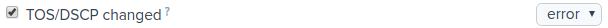

Web-Server
==========

Notification system
-------------------

Notification Triggers
~~~~~~~~~~~~~~~~~~~~~

There are three types of triggers depending on their settings method and functions:

* Triggers where each event generates triggering. Only level can be configured. 

* Triggers integrating event duration within the stated period. The event total duration, period and level can be configured.

* Triggers integrating the number of events within the stated period. The total number of events, period and level can be configured.

According to the notification type, the triggers can be divided into two groups: state and events.

**State** - this type of messages contains start and end points of an event.  The status is displayed in the Status field, that can have two values: active|cleared. The notifying messages are sent twice: at the start and in the end of an event. For example, if the BadSource (No signal) event is registered, and input data is lost, the message with Status = active is sent. When valid data occur (error is cleared), the second message with Status = cleared is sent, and the event end time is registered.  

**Event** - this type of messages is sent once. Basically, these messages refer to the state change. For example, if any change occurs in PSI table, the "Program Specific Information changed" message is automatically sent. For some events (Continuity Counter and Clock Continuity) the message is sent if the number of registered errors exceeds the preset value.

All available triggers and their short description are represented in the table below. See detailed description of parameters and events in the `Registered Parameters <probe.html#registered-parameters>`_ section. Detailed description of thresholds and configurations is represented in the section `Q: How to set up threshold profiles?`_

ETH
+++

.. csv-table:: 
   :header: "Trigger Name", "Type", "Default level", "Description"
   
	"TOS/DSCP changed", "event", "Error", "The Type Of Service / Differentiated Services Code Point field changed"
	"TTL changed", "event", "Error", "The Time To Live field changed"
	"IAT Error", "state", "Error", "The IAT Error threshold exceeded ."
	"IAT Warning", "state", "Warning", "The IAT Warning threshold exceeded ."
	"MLR Error", "state", "Error", "The MLR Error threshold exceeded ."
	"MLR Warning", "state", "Warning", "The MLR Warning threshold exceeded."
	"Max bitrate (Bitrate overflow)", "state", "Error", "Multicast bitrate exceeds the maximum threshold."
	"Min bitrate (Bitrate underflow)", "state", "Error", "Multicast bitrate goes below the minimum threshold."
	"BadSource (No signal)", "state", "Major", "There are no input data (or no OTT service)."
	"Several broadcasters", "state", "Error", "Several broadcasters are in the same group."

ETR (TR 101 290)
++++++++++++++++

.. csv-table:: **Priority 1**
   :header: "Trigger Name", "Type", "Default level", "Description"
   
   "TS Sync Loss", "state", "Major", "Loss of TS synchronization."
   "Sync Byte Error", "state", "Major", "There is no sync byte (0x47) in the following packet."
   "PAT Error", "state", "Major", "Errors occurred when receiving PAT."
   "Continuity Counter", "event", "Major", "Loss of transport packets (СС error)."
   "PMT Error", "state", "Major", "Errors occurred when receiving PMT."
   "PID error", "state", "Major", "Data does not occur for the specified PID within the stated period."
   "PID error (VidAud)", "state", "Major", "Data does not occur for the specified video/audio PID within the stated period."

.. csv-table:: **Priority 2**
   :header: "Trigger Name", "Type", "Default level", "Description"
   
   "Transport error", "state", "Major", "The Transport_error_indicator field = 1."
   "Clock Continuity", "event", "Major", "Backward time shifts, and sudden skips detected in PTS/DTS timestamps."

STR
+++

.. csv-table:: 
   :header: "Trigger Name", "Type", "Default level", "Description"
   
   "Invalid Elementary Stream", "state", "Major", "No video captions (SPS, PPS) are detected during 20 seconds. The stream can be encrypted."
   "Program Specific Information changed", "event", "Warning", "Stream information described in PAT, PMT or SDT changed."
   "Encryption map changed", "event", "Major", "PID encryption information changed."
   "Video Information changed", "event", "Warning", "Video stream captions changed."
   "Video Freeze Warning", "state", "Warning" 	
   "Video Freeze Error", "state", "Major", "Video freeze detected."

OTT
+++

.. csv-table:: 
   :header: "Trigger Name", "Type", "Default level", "Description"
   
   "Profile changed", "event", "OK", "Switching to a profile with different bitrate (only for the probe in the “Player” mode)."
   "The number of profiles changed", "event", "Warning", "The number of profiles in a Master playlist is changed."
   "Minimum profiles", "state", "Warning", "The number of profiles stated in the Master playlist is less than the minimum value set in thresholds configuration."
   "Profiles sequence divergence", "event", "Warning", "Media playlists contain divergence in the #EXT-X-MEDIA-SEQUENCE fields."
   "Profile streamtype changed", "event", "Warning", "Profile information contained in the Master playlist changed."
   "Profile duplicate bandwidth", "state", "Error", "The Master playlist has two similar maximum bitrates stated for different profiles (the BANDWIDTH fields)."
   "Profile invalid resolution", "state", "Error", "The Master playlist has invalid resolution in the RESOLUTION field."
   "Download bitrate low", "event", "Warning", "Download bitrate is low. Download time / segment duration >= warning threshold (%)."
   "Download bitrate too low", "event", "Error", "Download bitrate is too low. Download time / segment duration >= error threshold (%)."
   "Actual bitrate", "event", "Warning", "Average bitrate for a downloaded segment is higher or lower than the thresholds set by a user. The thresholds are set relating to the bitrate stated in a Master playlist, in percentage (%)."
   "Bad segment size", "event", "Error", "Segment bitrate exceeds the maximum bitrate specified in the BANDWIDTH field of a Master playlist by 50."
   "Manifest sequence discontinuity", "event", "Error", "Loss of one or more playlists and HLS segments detected. This error can be caused by OTT content generation and distribution issues or a probe insufficient performance."
   "Static manifest", "state", "Major", "The media playlist has not been updated during subsequent downloads. The exact number of download attempts is set by a user in the Number of identical playlist field (sequance_age). "
   "Manifest error", "event", "Major", "An error occurs while parsing a playlist. The playlist content has not been recognized or is not compliant with the standard."
   "Unknown manifest", "event", "Fatal", "Playlist has not been recognized."
   "Manifest Size", "state", "Warning", "A playlist size exceeds the Manifest size threshold set by a user."
   "Manifest download failure", "event", "Fatal", "A playlist can not be downloaded."
   "Key download failure", "event", "Error", "A decryption key can not be downloaded."
   "Segment download failure", "event", "Error", "Data segment can not be downloaded."
   "Skip segment (low system performance)", "event", "Major", "A segment is skipped. Insufficient performance of a probe."
   "Start with an IDR frame", "state", 	"Error", "The segment starts with the IDR frame"

SYS (Project settings > Probe profiles > SYSTEM)
++++++++++++++++++++++++++++++++++++++++++++++++

.. csv-table:: 
   :header: "Trigger Name", "Type", "Default level", "Description"
   
   "Out of memory warning", "state", "Warning", "Warning that RAM threshold exceeded."
   "Out of memory error", "state", "Error", "Error that RAM critical threshold exceeded."
   "High CPU usage warning", "state", "Warning", "Warning that CPU threshold exceeded."
   "High CPU usage error", "state", "Error", "Warning that CPU threshold exceeded."
   "Stalled state detected", "event", "Major", "Loss of connection with a probe"
   "Server connection loss", "event", "Major", "Loss of connection with the server"
   "Video buffer overflow", "event", "Major", "Data is flushed before decoding. Insufficient performance of a probe. "
   "Pcap loading error", "state", "Major", "Pcap/WinPcap driver loading error. **The error triggers if a probe has at least one task with Ethernet parameter analysis.**"
   "Task restart on crash detected", "event", "Major", "A child process analyzing the stream has been restarted by the parent process, because no reply was received within 10 s."

Q: How to set up threshold profiles?
~~~~~~~~~~~~~~~~~~~~~~~~~~~~~~~~~~~~

Open Project Settings > Task profiles > THRESHOLDS

To edit thresholds profile, click the profile name or copy one of the existing profiles and edit it. Pay attention, that each profile has a counter that displays the number of analyzed tasks with such a profile. There are three default profiles available in a new project (they can be edited, deleted or copied as samples for new profiles).

.. csv-table:: 
   :header: "**Profile**", "**Multicast**", "**OTT**", "**Features**"
   :widths: 10, 10, 10, 50
   
   "TV", "Yes", "No", "Designed to monitor SD IPTV. Ethernet parameters analysis is enabled (based on pcap). The TR 101 290 errors detection is enabled."
   "HDTV", "Yes", "No", "Designed to monitor HD IPTV. Ethernet parameters analysis is enabled (based on pcap). The TR 101 290 errors detection is enabled. The profile has narrower IAT thresholds and higher max. bitrate than the TV profile."
   "OTT", "No", "Yes", "Designed to monitor SD/HD OTT. The OTT events analysis is enabled. The TR 101 290 errors detection is disabled (can be enabled for unencrypted services and AES-128 services, if required). Ethernet parameters analysis is disabled."

Ethernet parameters
+++++++++++++++++++

To allow `Ethernet parameters <probe.html#ethernet-parameters>`_ analysis, enable the corresponding checkbox. If the checkbox is disabled, the IAT, DF and MLR parameters are not calculated, and the statistics is not sent to the server. For OTT monitoring service profiles checkbox should be disabled.

.. csv-table:: **Ethernet parameters**
   :header: "**Threshold Name**", "**Default value**", "**Description**"
   :widths: 15, 15, 50
   
   "IAT Error, ms", "50 - TV, 30 - HDTV", "IAT threshold upon which a probe sets the Error value, in milliseconds."
   "IAT Warning, ms", "45 - TV, 20 - HDTV", "IAT threshold upon which a probe sets the Warning value, in milliseconds."
   "MLR Error", "8 - TV/HDTV", "The max. number of transport packets lost per second upon which a probe sets the Error value."
   "MLR Warning", "1- TV/HDTV", "The max. number of transport packets lost per second upon which a probe sets the Warning value."
   "Multicast Bitrate overflow, Kbps", "15000 - TV, 30000 - HDTV",  "Max. multicast bitrate upon which a probe sets the Bitrate overflow error."
   "Multicast Bitrate underflow, Kbps", "100 - TV, 1000 - HDTV", "Min. multicast bitrate upon which a probe sets the Bitrate underflow value."

TR 101 290
++++++++++

To allow stream analysis according to the TR 101 290 standard, set the corresponding checkbox. The standard provides thresholds, but strict compliance with the standard requirements is not mandatory for IPTV streams. Correspondingly, threshold configurations can be set by a user to exclude unwanted trigger actions. TR 101 290 analysis can be applied either for IPTV or for unencrypted OTT services (or for services that can be decrypted).

.. csv-table:: **TR 101 290 compliance**
   :header: "**Threshold Name**", "**Default value**", "**Description**"
   :widths: 15, 15, 50
   
   "PAT error interval, ms", "500", "PID 0x0000 (PAT) should occur in a stream at least every “interval”, in milliseconds."
   "PMT error interval, ms", "500", "Sections with table_id 0x02, (i.e. PMT) should occur in a stream at least every “interval”, in milliseconds. PMT has PID specified in PAT. **“0” value in thresholds configuration disables PMT Error detection.**"
   "Audio/Video PID error interval, ms", "5000", "Audio/Video PID data does not occur during the stated period. It corresponds to partial loss of connection with the server or to errors occurred in PAT/PMT. **“0” value in thresholds configuration disables AV PID Error detection.**"
   "Other PIDs error interval, ms", "5000", "Specified PID (other PIDs) data does not occur during the stated period. It corresponds to partial loss of connection with the server or to errors occurred in PAT/PMT. **“0” value in thresholds configuration disables PID Error detection.**"
   "ClockContinuity error interval, ms", "1000", "Specifies maximum time interval between PTS timestamp values, in milliseconds. Backward time shifts generate an error despite of a threshold value. **“0” value disables the ClockContinuity error detection.**"
   "VideoFreeze detection interval, s", "5", "Specifies a threshold in seconds. If video freeze exceeds the stated period the VideoFreeze event is sent to the server. This threshold configures video freeze detector sensitivity."

OTT control
+++++++++++

OTT parameter analysis and Query String configurations are activated by enabling the corresponding checkbox. To monitor OTT services, the parameter should be enabled.

.. csv-table:: **OTT control**
   :header: "**Threshold Name**", "**Default value**", "**Description**"
   :widths: 15, 15, 50
   
   "Download speed error, %", "100", "The **Download bitrate too low** error is generated if download speed is lower than the stated threshold Download speed error, in percentage. Download time / segment duration >= error threshold (%). "
   "Download speed warning, %", "80", "The **Download bitrate low** warning is generated if download speed is lower than the stated threshold Download speed warning, in percentage. Download time / segment duration >= warning threshold (%). Warning threshold can not exceed the error threshold."
   "Actual bitrate min, %", "50", "Average bitrate of the downloaded segment is less than the thresholds set by a user.  Actual bitrate min sets the the lowest threshold relating to bitrate stated in a Master playlist, in percentage. The **Actual bitrate** error is generated when downloaded segment size / specified duration <= profile specified bitrate (%)."
   "Actual bitrate max, %", "200", "Average bitrate of the downloaded segment is higher than the thresholds set by a user. Actual bitrate max sets the the highest threshold relating to bitrate stated in a Master playlist, in percentage. The **Actual bitrate** error is generated when downloaded segment size / specified duration >= profile specified bitrate (%)."
   "Number of identical playlist downloads", "3", "Specifies the number of sequent downloading attempts of a media playlist.  A pause equal to download duration of the last segment is made between download attempts. If a media playlist has not been updated during sequent downloads, the **Static manifest** error is generated"
   "Manifest size, bytes", "500000", "If manifest size exceeds the stated threshold, the **Manifest size** error is generated."
   "Min. profiles", "1", "If the number of profiles stated in a Master playlist is less than the minimum threshold, the **Minimum profiles** error is generated."

HTTP query string parameters
++++++++++++++++++++++++++++

The section is designed to configure additional parameters in HTTP request from a probe. See more details in `Q: How to transfer additional parameters in HTTP requests?`_.

Configuring Tasks to be Analyzed
++++++++++++++++++++++++++++++++

Open the probe page (by clicking the probe name in the side flip).

.. important:: The probe should be active, and all analyzed tasks should be started

Set checkboxes to all tasks requiring the threshold profile to be applied and click the Configure button. 

The dialog window should open. Select the required profile for the Profile Threshold field and click Apply. The configuration system is quite flexible. For example, it is possible to apply different profiles to different tasks within one probe.

.. note:: A task must have thresholds profile. The TV profile is set by default.

System Profiles
+++++++++++++++

Some thresholds to be configured are located in the system profiles related to a probe. Open Project Settings > Probe profiles > SYSTEM

	   
To edit system profile, click the profile name or copy one of the existing profiles and edit it. Pay attention, that each profile has a counter that displays the number of analyzed tasks with such a profile. 

Set up the system performance thresholds.

.. csv-table:: **System**
   :header: "**Threshold Name**", "**Default value**", "**Description**"
   :widths: 15, 15, 50
   
   "CPU warning, %", "70", "CPU load in percentage, when a probe sends the CPU warning state."
   "CPU error, %", "90", "CPU load in percentage, when a probe sends the CPU error state."
   "RAM warning, %", "70", "RAM utilization in percentage,when a probe sends the CPU warning state." 
   "RAM error, %", "90", "RAM utilization in percentage,when a probe sends the CPU error state."

Open the probe page (by clicking the probe name in the side flip).

.. note:: The probe should be active.

Select the required profile from the drop-down menu (by clicking Edit).

Q: Configuring and Using SNMP Notification
~~~~~~~~~~~~~~~~~~~~~~~~~~~~~~~~~~~~~~~~~~

General information
+++++++++++++++++++

Be advised that SNMP trap notification system is designed in a way that a probe is considered a gateway. It means that a decision on notification transfer and the message body are generated on the server and are transmitted to the probe over https. The decision on notification transfer is made on the server and based on the pre-configured triggers. The probe functions as a gateway, and the message received from the server is transmitted to the specified trap destination IP address [:Port] over SNMP.

MIB Files
+++++++++

The probe package downloaded from the personal account contains two MIB files:

- `ELECARD-MIB.txt <https://boro.elecard.com/ELECARD-MIB.txt>`_
- `ELECARD-BORO-TRAP-MIB.txt <https://boro.elecard.com/ELECARD-BORO-TRAP-MIB.txt>`_

The files should be copied to the required location and added to configurations set for the trap management system.  

.. note:: “SnmpAdminString” syntax supporting UTF-8 encoding is used in a MIB file for some fields transfer. UTF-8 has backward compatibility with ASCII code. It means that if ASCII characters are used in names of probes and analyzed channels, the "SnmpAdminString" fields will look like as ASCII strings.

Configuring notification thresholds
+++++++++++++++++++++++++++++++++++

Set up and apply profiles to tasks according to the section `Q: How to set up threshold profiles?`_. Make sure that the proper profile is selected for OTT monitoring tasks and “OTT control” is enabled.

Configuring SNMP Notification Profile Open Project Settings > Task profiles > SNMP 
++++++++++++++++++++++++++++++++++++++++++++++++++++++++++++++++++++++++++++++++++++++++++

To edit SNMP notification profile, click the profile name or copy one of the existing profiles and edit it. Pay attention, that each profile has a counter that displays the number of analyzed tasks with such a profile. See more details on how to apply the profile to a task below (`Configuring Tasks to be Analyzed <web-server.html#id2>`_).

Select timezone from the drop-down box and enable a checkbox for “Send error notifications via SNMP”. 
 
Select Community string and set up to three trap destination IP addresses is required. Address should be set in the format IP:[PORT], for example, 10.10.30.235:1234. If the port is not specified, the default port 162 is used. 

It is possible to choose a gateway (probe) to send out SNMP trap messages. If the Triggered option is selected, SNMP trap messages are sent via the triggered probe analyzing the stream. The Triggered option is required if the probes are located in different networks with several traps. It is possible to send all SNMP trap messages via the same probe, if the probe name is selected from the drop-down box. 

.. note:: The probe should be successfully started at least once, to get the probe name in the drop-down list.

Enable and configure the required triggers. The triggers are divided into functional groups. See detailed description of parameters and events in `Registered Parameters`_. See detailed description of triggers in the `Notification Triggers`_ section.

After configuring the profile click the Save button.

.. note:: It takes up to 1-2 minutes to apply new configurations depending on the number of tasks with the stated profile. 

.. note:: To terminate sending out of SNMP trap messages to all tasks with the selected profile, disable a checkbox “Send error notifications via SNMP” in the profile settings.   

Configuring Tasks to be Analyzed
++++++++++++++++++++++++++++++++

Open the probe page (by clicking the probe name in the side flip).

.. note:: The probe should be active, and all analyzed tasks should be started. 

Set checkboxes to all tasks requiring the SNMP notification profile to be applied and click the Configure button. 

The dialog window should occur. Select the required profile for the Profile SNMP field and click Apply. Transmission of SNMP trap messages is permitted for the selected tasks according to the triggers set in the profile.

The configuration system is quite flexible. For example, it is possible to apply different profiles to different tasks within one probe.

.. note:: To restrict transmission of SNMP trap messages for a task, select the None value for the SNMP profile.

After configuration of tasks settings, trap messages should be automatically sent if an event is triggered. If the parameters have been correctly configured, the trap should receive messages.

Configuring and Applying System Profile
+++++++++++++++++++++++++++++++++++++++

These settings are optional. The settings belong to the probe configurations.

Go to Project settings > Probe profiles > SYSTEM 

To edit the System profile, click the profile name or copy one of the existing profiles and edit it. Pay attention that each profile has a counter that displays the number of probes with such a profile.

SNMP notification system settings are displayed in the bottom-right corner of the page. 

To set configurations follow the steps below:

* Specify community string
* Specify trap destination IP address IP:[PORT]
* Select the probe to be used for notification or the Triggered option
* Select and configure the required triggers 
* Save settings

Open the probe page (by clicking the probe name in the side flip).

.. note:: The probe should be active.

Select a required profile from the drop-down menu (by clicking the Edit option).

Structure of SNMP trap message
++++++++++++++++++++++++++++++

It is required to have two MIB files contained in the probe package for proper operation:

- `ELECARD-MIB.txt <https://boro.elecard.com/ELECARD-MIB.txt>`_
- `ELECARD-BORO-TRAP-MIB.txt <https://boro.elecard.com/ELECARD-BORO-TRAP-MIB.txt>`_

The decision on message transfer is based on the pre-set triggers analysis (see the `Notification Triggers`_ section). 

There are three types of SNMP trap messages described in ELECARD-BORO-TRAP-MIB:

1.	State change notification (state in `Notification Triggers`_)
	These messages are sent twice: at the start and in the end of an event.

	``{ status, probeName, taskName, errorName, level, beginTime, endTime, trapTime }``
		**status** - defines state: active|cleared;
		
		**probeName** - specifies a name of the probe analyzing a stream where a state is triggered;
		
		**taskName** - specifies a name and URI of a stream where a state is triggered;
		
		**errorName** - specifies an error (trigger) name;
		
		**level** - specifies an error severity level stated in trigger configurations;
		
		**beginTime** - specifies start time of a state;
		
		**endTime** - if status = active, the value is zero, if status = cleared, the value specifies end time of a state;
		
		**trapTime** - specifies time when SNMP trap message is generated.

2.	Event occurrence notification (event in “Notification Triggers”)
	These messages are sent once, when an event is triggered.
	
	``{ probeName, taskName, errorName, level, beginTime, endTime, errorsCount, trapTime }``
	
		**probeName** - specifies a name of the probe analyzing a stream where an event is triggered;
		
		**taskName** - specifies a name and URI of a stream where an event is triggered;
		
		**errorName** - specifies an error (trigger) name;
		
		**level** - specifies an error severity level stated in trigger configurations;
		
		**beginTime** - specifies start time of a event (time of the first detected error for Continuity Counter and Clock Continuity);
		
		**endTime** - time of the last detected error for Continuity Counter and Clock Continuity, the “0” value is transferred for other events;
		
		**errorsCount** - specifies the number of errors (Continuity Counter and Clock Continuity) occured within the stated period; the “1” value is transferred for other events.
		
		**trapTime** - specifies time when SNMP trap message is generated.

3.	Server connection loss notification
	These messages are sent by the probe that connection with the server has been lost. The message is sent by the probe that has lost connection with the server despite of the chosen gateway.
	
	``{ probeName, messageError, beginTime }``
		
		**probeName** - specifies a name of the probe that has lost connection
		
		**messageError** - a message notifying about loss of connection with the server;
		
		**beginTime** - specifies start time of a state.

Monitoring OTT Services
-----------------------

Q: How to change User-agent in HTTP requests?
~~~~~~~~~~~~~~~~~~~~~~~~~~~~~~~~~~~~~~~~~~~~~

User-Agent is a text string included in a header of HTTP request starting with User-agent: or User-Agent:. The string contains name, application version, OS and language. 

If the field is blank, "Boro client (<PLATFORM>) <VERSION>" is used as User-agent by default. 
To edit User-agent, open Project Settings > Probe Profiles > SYSTEM

To edit the System profile, click the profile name or copy one of the existing profiles and edit it. Pay attention that each profile has a counter that displays the number of probes with such a profile.

Type into the UserAgent field (the string length is up to 4kB) and click the Save button located at the bottom of the page.

Go to the probe page (by clicking the probe name in the side flip).

.. important:: The probe should be active.

Select a required profile from the drop-down menu (by clicking the Edit option).

After applying the pre-set profile, the probe should send requests with the stated User-Agent.

Q: How to transfer additional parameters in HTTP requests?
~~~~~~~~~~~~~~~~~~~~~~~~~~~~~~~~~~~~~~~~~~~~~~~~~~~~~~~~~~

**Query string parameters** - is a string, part of URL, containing data that should be sent to the server but can not be included in path structure.

The parameters are set in the threshold profile. Detailed information on how to set up and apply threshold profiles is described in the `Q: How to set up threshold profiles?`_.

.. important:: The OTT control checkbox should be enabled.

Set the required parameters in the “HTTP query string parameters” section. To add several parameters, click the “+” button. After editing the profile, save it by clicking the Save button.

For example, see a query string without parameters below:  ``http://MyOTTservice.com/service1.m3u8``

If the parameters are set as shown in the figure below: 

the query string should be as follows:

``http://MyOTTservice.com/service1.m3u8?param1=val1&param2=val2.``

Apply the configured threshold profiles to the task in the task settings.

**Force** - forcible reassigning of the specified parameters if they have already been included in a query string. If this setting is disabled, the parameters with the same names are not reassigned. If the specified parameters are not included in a query string, they are automatically added despite of the "force" setting state.

